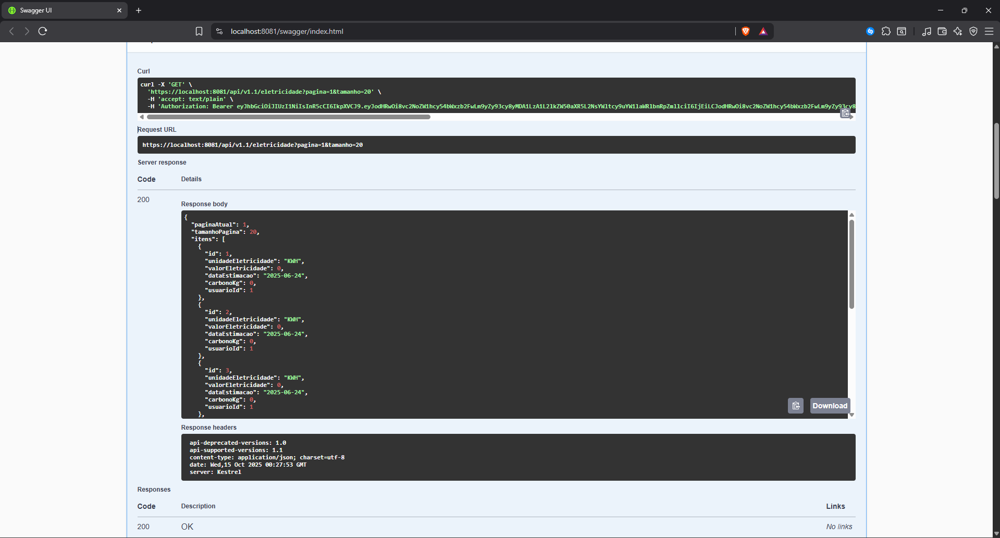
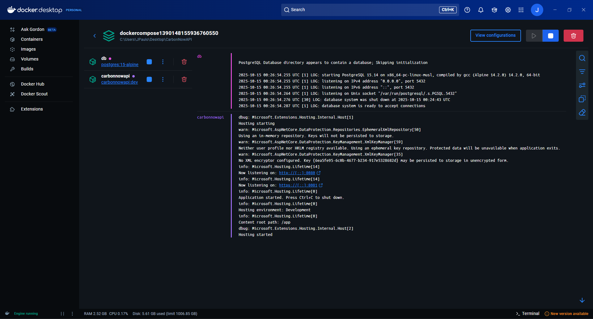
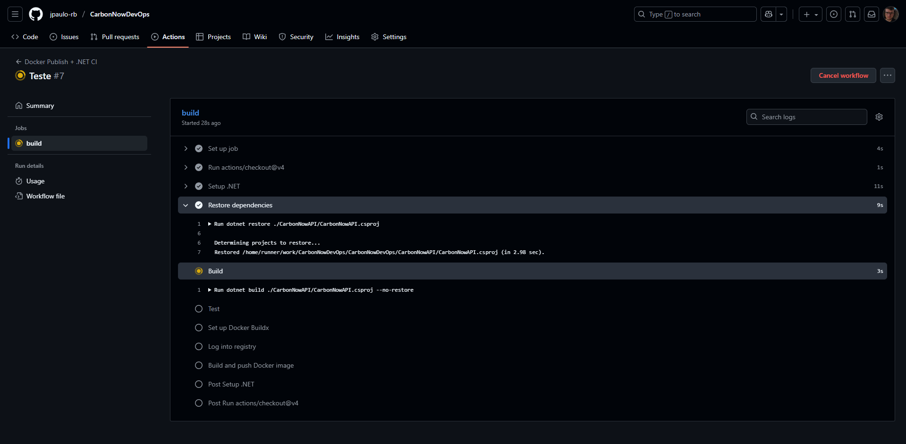
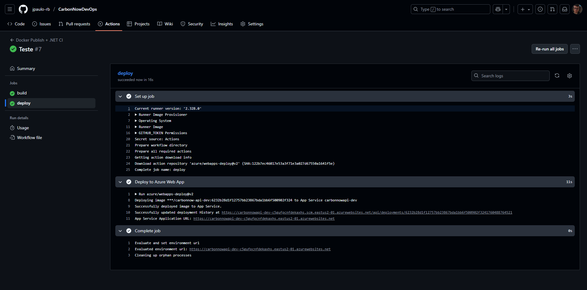
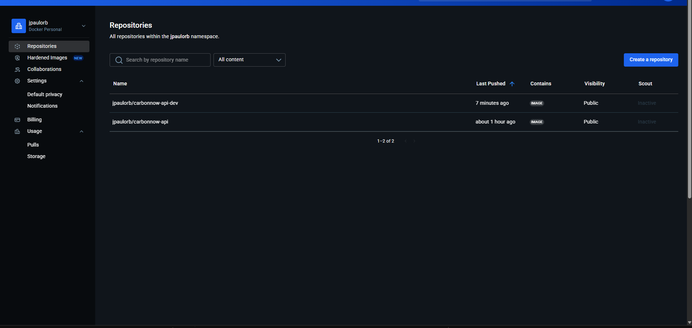
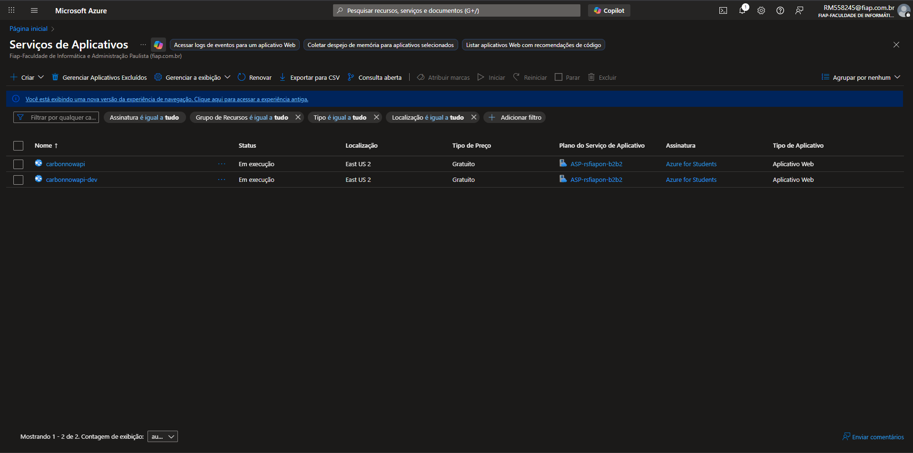
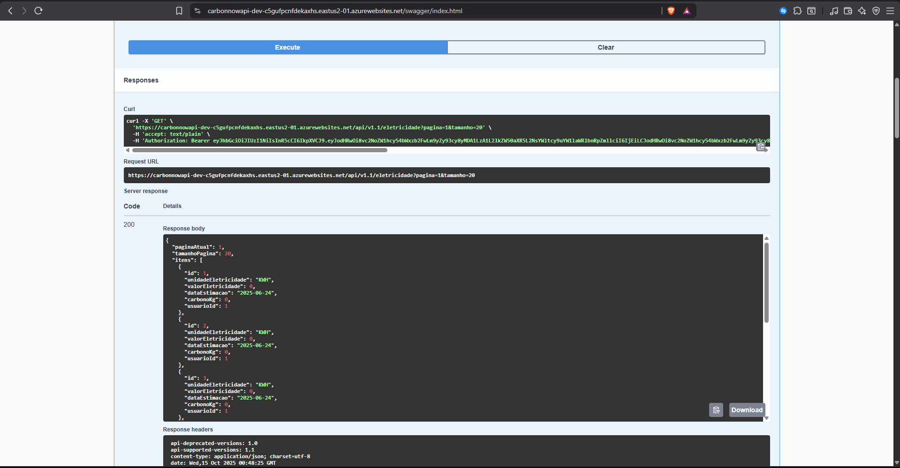

# API REST – Projeto CarbonNowAPI

## Visão Geral
Esta API foi desenvolvida em **C# (.NET 8)** para fornecer endpoints REST de forma escalável e containerizada.  
O projeto utiliza **Oracle Database** como persistência, e é totalmente automatizado via **GitHub Actions** para build, testes, publicação no **Docker Hub** e deploy contínuo na **Azure**.

---

## Como executar localmente com Docker

### Pré-requisitos
- Docker  
- Docker Compose  

### Passos

**1. Clone o repositório:**
```bash
git clone https://github.com/jpaulo-rb/CarbonNowDevOps.git
cd CarbonNowAPI
```

**2. Configure as variáveis de ambiente (appsettings.json):**
```json
{
  "ConnectionString:Oracle": "User Id=SeuUsuario;Password=SuaSenha;Data Source=SeuDataSource",
  "Jwt:Key": "SuaJwtKey",
  "Jwt:Issuer": "SeuJwtIssuer",
  "Jwt:Audience": "SeuJwtAudience"
}
```

**3. Build e execução do container:**
```bash
docker-compose up --build
```

**4. Acesse a aplicação:**
- Swagger: [https://localhost:8081/swagger/index.html](https://localhost:8081/swagger/index.html)

---

## Pipeline CI/CD

A automação do projeto é realizada com **GitHub Actions**, permitindo integração e entrega contínua (CI/CD) de forma confiável.  

### Ferramentas utilizadas
- **GitHub Actions**: orquestra os jobs de build, teste e deploy.  
- **Docker Hub**: armazena as imagens containerizadas da API.  
- **Azure App Service**: hospeda a aplicação em produção.

### Etapas do pipeline

1. **Trigger**  
   O pipeline é disparado em push ou pull request nas branches `main` ou `develop`.

2. **Build**  
   Compila a API e valida dependências.

3. **Testes**  
   Executa testes unitários e verifica a cobertura de código.

4. **Docker Build & Push**  
   Gera a imagem Docker da API e envia para o **Docker Hub**.

5. **Deploy na Azure**  
   Realiza o deploy automático da imagem mais recente no **Azure App Service**.

### Exemplo de workflow (GitHub Actions)
```yaml
jobs:
  build:
    runs-on: ubuntu-latest
    steps:
    - uses: actions/checkout@v4
    
    - name: Setup .NET
      uses: actions/setup-dotnet@v4
      with:
        dotnet-version: 8.0.x
        
    - name: Restore dependencies
      run: dotnet restore ./CarbonNowAPI/CarbonNowAPI.csproj
      
    - name: Build
      run: dotnet build ./CarbonNowAPI/CarbonNowAPI.csproj --no-restore
      
    - name: Test
      run: dotnet test ./CarbonNowAPI-Teste/CarbonNowAPI-Teste.csproj --verbosity normal

    - name: Set up Docker Buildx
      uses: docker/setup-buildx-action@v3

    - name: Log into registry
      uses: docker/login-action@v3
      with:
        registry: https://index.docker.io/v1/
        username: ${{ secrets.DOCKERHUB_USERNAME }}
        password: ${{ secrets.DOCKERHUB_TOKEN }}

    - name: Build and push Docker image
      uses: docker/build-push-action@v5
      with:
        push: true
        tags: ${{ secrets.DOCKERHUB_USERNAME }}/carbonnow-api:${{ github.sha }}
        context: .
        file: ./CarbonNowAPI/Dockerfile


  deploy:
      runs-on: ubuntu-latest
      needs: build
      environment:
        name: 'production'
        url: ${{ steps.deploy-to-webapp.outputs.webapp-url }}
 
      steps:
      - name: Deploy to Azure Web App
        id: deploy-to-webapp
        uses: azure/webapps-deploy@v2
        with:
          app-name: 'carbonnowapi'
          slot-name: 'production'
          publish-profile: ${{ secrets.AZURE_PROFILE }}
          images: '${{ secrets.DOCKERHUB_USERNAME }}/carbonnow-api:${{ github.sha }}'
```

---

## Containerização

A aplicação é totalmente **containerizada** utilizando Docker. O processo segue uma **multi-stage build** para otimizar o tamanho da imagem e separar fases de build, publish e runtime.

### Dockerfile

```dockerfile
# Fase base (runtime)
FROM mcr.microsoft.com/dotnet/aspnet:8.0 AS base
USER $APP_UID
WORKDIR /app
EXPOSE 8080
EXPOSE 8081

# Fase de build
FROM mcr.microsoft.com/dotnet/sdk:8.0 AS build
ARG BUILD_CONFIGURATION=Release
WORKDIR /src
COPY ["CarbonNowAPI/CarbonNowAPI.csproj", "CarbonNowAPI/"]
RUN dotnet restore "./CarbonNowAPI/CarbonNowAPI.csproj"
COPY . .
WORKDIR "/src/CarbonNowAPI"
RUN dotnet build "./CarbonNowAPI.csproj" -c $BUILD_CONFIGURATION -o /app/build

# Fase de publish
FROM build AS publish
ARG BUILD_CONFIGURATION=Release
RUN dotnet publish "./CarbonNowAPI.csproj" -c $BUILD_CONFIGURATION -o /app/publish /p:UseAppHost=false

# Fase final (produção)
FROM base AS final
WORKDIR /app
COPY --from=publish /app/publish .
ENTRYPOINT ["dotnet", "CarbonNowAPI.dll"]
```

### Estratégias adotadas

- **Multi-stage build**: separa build, publish e runtime, reduzindo tamanho final da imagem.  
- **Imagem base runtime (`aspnet:8.0`)**: apenas para execução, menor footprint.  
- **Build e publish separados**: garante que apenas os artefatos necessários vão para a fase final.  
- **Exposição de portas 8080 e 8081**: padrão para desenvolvimento e depuração.  
- **Compatível com Visual Studio**: suporta builds rápidos de depuração e execução normal.  
- **Uso de ARG `BUILD_CONFIGURATION`**: permite alternar entre Release e Debug facilmente.

### docker-compose.yml (para desenvolvimento)

```yaml
services:
  carbonnowapi:
    build:
      context: .
      dockerfile: CarbonNowAPI/Dockerfile
    image: carbonnowapi
    depends_on:
      - db
    ports:
      - "8080:8080"
      - "8081:8081"
    environment:
      - ASPNETCORE_ENVIRONMENT=Development
    networks:
      - app-network

  db:
    container_name: mydb
    image: postgres:15-alpine
    restart: always
    environment:
      - POSTGRES_DB=mydb
      - POSTGRES_USER=myuser
      - POSTGRES_PASSWORD=mypassword
    volumes:
      - db_data:/var/lib/postgresql/data
    networks:
      - app-network

volumes:
  db_data:

networks:
  app-network:
    driver: bridge
```

> **Observação:** o serviço `db` está definido no Compose, mas **não é utilizado pela API**, que continua conectando ao Oracle Database.

---

## Prints do funcionamento

### 1. Swagger / Endpoints ativos


### 2. Container docker-compose rodando


### 3. CI/CD - Build


### 4. CI/CD - Deploy


### 6. Docker Hub


### 6. App Service Azure


### 7. Swagger na azure 
> Habilitado somente para demonstração


---

## Tecnologias e práticas utilizadas

| Categoria                  | Tecnologia / Ferramenta / Padrão                    |
|----------------------------|-----------------------------------------------------|
| Linguagem                  | C# (.NET 8)                                         |
| Framework Web              | ASP.NET Core Web API, MVC                           |
| Banco de Dados             | Oracle Database                                     |
| Migrations / ORM           | Entity Framework Core / Migrations                  |
| Segurança / Autenticação   | JWT (Json Web Tokens)                               |
| Containerização            | Docker, Docker Compose                              |
| CI/CD                      | GitHub Actions                                      |
| Registro de Imagens        | Docker Hub                                          |
| Hospedagem                 | Azure App Service                                   |
| Configuração Segura        | Secrets na Azure (Connection Strings e JWT Keys)    |
| Documentação               | Swagger                                             |
| Middleware                 | Custom Middleware para tratamento de exceptions     |
| Design Patterns            | ViewModels, Clean Architecture                      |
| Configuração               | appsettings.json                                    |

